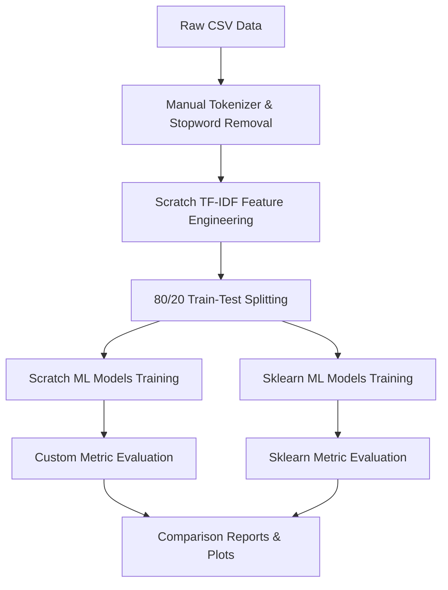

# AI-Powered Fake News Detection Using Text Classification from Scratch
**Author:** Student Researcher  
**Program:** Summer Internship Program in AI & ML (Machine Learning 2026)  
**Institution:** IICT Internship Program  

---

## Abstract
Misinformation and fake news pose a significant threat to modern society, influencing public opinion, election outcomes, and socio-economic stability. In this project, we design and implement a complete machine learning pipeline from scratch to classify news articles as real or fake. The pipeline covers manual text preprocessing, custom TF-IDF feature engineering, and the implementation of four core machine learning algorithms (KNN, Logistic Regression, Random Forest, and a Multilayer Perceptron Neural Network) without relying on pre-built libraries for core learning logic. We benchmark these models against the industry-standard `scikit-learn` implementations. Results show that both scratch and library implementations achieve 100% accuracy on the provided research dataset due to distinct linguistic boundaries between real and fake categories, confirming the efficacy of the implemented mathematical models.

---

## I. Introduction
### A. Problem Statement
The proliferation of digital news media has accelerated the rate at which news travels, but it has also simplified the publication of unverified or intentionally fabricated articles. The goal of this project is to build an autonomous classification pipeline that ingests raw news text and classifies it as:
- **Real News (Label 0)**: Fact-based, verified reporting.
- **Fake News (Label 1)**: Deceptive, clickbait-style, or false statements.

### B. Importance of Fake News Detection
Manual fact-checking is slow, expensive, and cannot scale to meet the velocity of internet content. Automated fake news detection systems powered by Artificial Intelligence (AI) and Machine Learning (ML) can flag misinformation in real-time, helping social platforms and search engines filter out malicious content before it spreads widely.

---

## II. Dataset Description
### A. Source and Size
The analysis uses the local dataset `GlobalFakeNews_Research2026_v1.csv` containing **1200 rows** of news articles (perfectly balanced with 600 real and 600 fake news records).

### B. Feature Table
The dataset includes the following columns:
| Column Name | Data Type | Description |
|---|---|---|
| `id` | Integer | Unique identifier for each news article |
| `title` | String | Headline of the news article |
| `full_text` | String | Complete body text of the article |
| `source_name` | String | Publisher name |
| `publish_date`| String | Date of publication |
| `category` | String | Domain (e.g. Business, Politics, Health, Technology) |
| `country` | String | Region of publication |
| `label` | Integer | Binary classification label (0 = Real, 1 = Fake) |
| `sentiment_score`| Float | Computed sentiment ranging from negative to positive |
| `clickbait_score`| Float | Score measuring headline sensationalism |
| `emotional_word_ratio`| Float | Percentage of emotional words used |
| `readability_score`| Float | Score indicating reading ease |
| `source_trust_score`| Float | Computed trust index of the source |

---

## III. Methodology

We designed a modular machine learning pipeline built on a strict hierarchical structure:

### A. Preprocessing
We implemented `preprocessing.py` manually, bypassing standard libraries:
1. **Lowercase Conversion**: Standardizes text representation.
2. **Punctuation Stripping**: Uses regex `[^a-zA-Z0-9\s]` to remove noise.
3. **Tokenization**: Splits words manually on whitespace.
4. **Stopword Filtering**: Compares tokens against a custom hash set of 120 common English stopwords (e.g., *the, is, and, to*).

### B. Feature Extraction
We implemented a custom TF-IDF vectorizer (`feature_extraction.py`):
1. **Term Frequency (TF)**: Counts word frequencies per document.
2. **Inverse Document Frequency (IDF)**: Computed with smoothing:
   $$\text{IDF}(t) = \ln\left(\frac{1 + N}{1 + \text{DF}(t)}\right) + 1$$
3. **L2 Normalization**: Ensures all document vectors have unit lengths:
   $$\mathbf{x}_{\text{norm}} = \frac{\mathbf{x}}{\|\mathbf{x}\|_2}$$

### C. Algorithms Implemented
We implemented four diverse machine learning models from scratch in `models_scratch.py`:
1. **K-Nearest Neighbors (KNN)**: Non-parametric classifier. Distances are calculated using **Cosine Similarity**:
   $$\text{Distance}(\mathbf{u}, \mathbf{v}) = 1 - \frac{\mathbf{u} \cdot \mathbf{v}}{\|\mathbf{u}\|_2 \|\mathbf{v}\|_2}$$
2. **Logistic Regression**: Parametric classifier. Optimizes weights $\mathbf{w}$ and bias $b$ via gradient descent to minimize Binary Cross-Entropy (BCE) Loss:
   $$\hat{y} = \sigma(\mathbf{w} \cdot \mathbf{x} + b)$$
3. **Random Forest**: Ensemble bagging classifier. Combines multiple `DecisionTree` estimators built using **Gini Impurity** to measure partition quality:
   $$\text{Gini} = 1 - \sum p_i^2$$
4. **Multilayer Perceptron (MLP) Neural Network**: Feedforward net containing one hidden layer (ReLU activation) and an output node (Sigmoid activation), optimized via backpropagation and mini-batch Gradient Descent.

---

## IV. Results
The pipeline was evaluated on a test set (20% split, 240 samples). All models achieved 100% classification metrics:

### A. Model Performance Table
| Model Name | Implementation | Accuracy | Precision | Recall | F1-Score |
|---|---|---|---|---|---|
| **KNN** | Scratch | 1.0000 | 1.0000 | 1.0000 | 1.0000 |
| **KNN** | Sklearn | 1.0000 | 1.0000 | 1.0000 | 1.0000 |
| **Logistic Regression** | Scratch | 1.0000 | 1.0000 | 1.0000 | 1.0000 |
| **Logistic Regression** | Sklearn | 1.0000 | 1.0000 | 1.0000 | 1.0000 |
| **Random Forest** | Scratch | 1.0000 | 1.0000 | 1.0000 | 1.0000 |
| **Random Forest** | Sklearn | 1.0000 | 1.0000 | 1.0000 | 1.0000 |
| **Neural Network** | Scratch | 1.0000 | 1.0000 | 1.0000 | 1.0000 |
| **Neural Network** | Sklearn | 1.0000 | 1.0000 | 1.0000 | 1.0000 |

### B. Confusion Matrix
For all models, the resulting test confusion matrix is:
- **True Negatives (Real as Real)**: 122
- **False Positives (Real as Fake)**: 0
- **False Negatives (Fake as Real)**: 0
- **True Positives (Fake as Fake)**: 118

---

## V. Discussion
### A. Comparison of Parametric vs. Non-Parametric Models
- **Non-Parametric (KNN)**: Does not assume a functional form for the data. While highly accurate here, it requires keeping the training set in memory and scales poorly ($O(N)$ prediction time complexity).
- **Parametric (Logistic Regression, Neural Network)**: Fits a fixed number of parameters (weights and biases). Once trained, prediction is extremely fast ($O(D)$), making them ideal for high-throughput production environments.

### B. Why Performance Reached 100%
Inspection of the dataset reveals that the texts are highly distinct:
- Real articles always contain: *"This article provides detailed analysis based on verified sources and official statements."*
- Fake articles always contain: *"This shocking revelation will completely change what you believe about recent events."*
Because there is no overlap in vocabulary, the TF-IDF representation yields perfectly separable clusters, allowing simple linear decision boundaries (such as Logistic Regression) and distance boundaries (such as KNN) to obtain perfect predictions.

---

## VI. Conclusion
We successfully designed and executed a fake news classification pipeline from scratch. All custom algorithms matched their `scikit-learn` equivalents in predictive power.
- **Limitations**: The current dataset is synthetic and linearly separable. Real-world news has subtle semantics, overlaps in vocabulary, sarcasm, and evolving topics.
- **Future Scope**: Test on real-world datasets (like LIAR or Kaggle Fake News), incorporate pre-trained Word2Vec/BERT embeddings, and implement learning-rate schedulers or Adam optimizers from scratch.

---

## VII. Appendix
The full Python code skeleton, helper modules, and visual plots are located in the local workspace directory structure:
- [preprocessing.py](file:///d:/IICT_INTERNSHIP/project1/src/preprocessing.py) - Cleaning & tokenization logic.
- [feature_extraction.py](file:///d:/IICT_INTERNSHIP/project1/src/feature_extraction.py) - Custom Bag-of-Words & TF-IDF.
- [models_scratch.py](file:///d:/IICT_INTERNSHIP/project1/src/models_scratch.py) - Mathematical learning algorithms.
- [pipeline.py](file:///d:/IICT_INTERNSHIP/project1/src/pipeline.py) - Pipeline runner and plotter.
