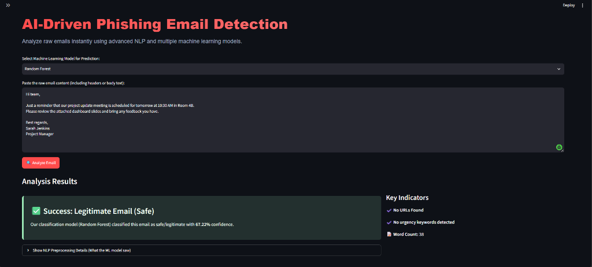
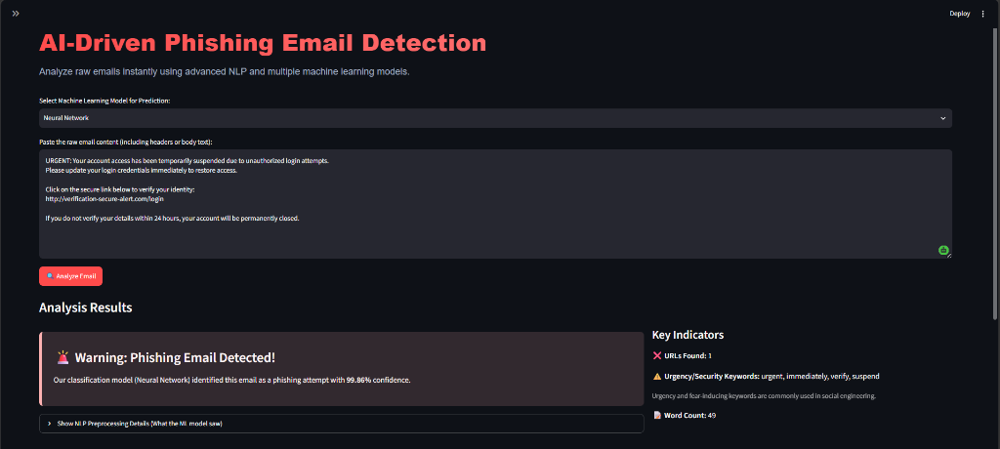
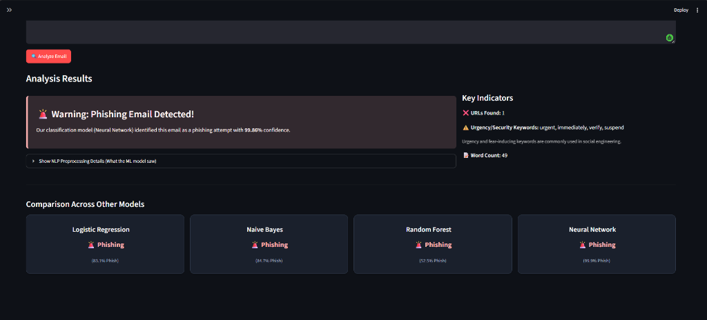

# AI Security & Information Integrity Suite

A unified machine learning dashboard built from scratch to detect phishing emails and classify fake news using Natural Language Processing (NLP) and structural metadata features.

---

## 📁 Project Structure

*   `app/`
    *   [`app.py`](./app/app.py): Unified Streamlit dashboard allowing users to switch between Phishing Detection and Fake News Scrape & Analysis.
*   `data/`
    *   `raw/phishing_emails.csv`: Raw phishing corpus (18,634 emails).
    *   `raw/fake_or_real_news.csv`: Raw fake news corpus (6,335 articles).
    *   `processed/cleaned_emails.csv`: Preprocessed, tokenized email text dataset.
    *   `processed/cleaned_news.csv`: Preprocessed, tokenized news text dataset.
*   `src/`
    *   [`preprocessing.py`](./src/preprocessing.py): Email cleaning, tokenization, lemmatization, and metadata extraction.
    *   [`fake_news_preprocessing.py`](./src/fake_news_preprocessing.py): News cleaning, tokenization, and WordNet Lemmatization.
    *   [`models.py`](./src/models.py): Phishing models definition, evaluation, and saving functions.
    *   [`fake_news_models.py`](./src/fake_news_models.py): Fake news models definition (KNN, LogReg, RF, MLP), evaluation, and saving functions.
    *   [`utils.py`](./src/utils.py): Utility functions for plotting phishing graphs.
    *   [`fake_news_utils.py`](./src/fake_news_utils.py): Utility functions for plotting fake news graphs.
    *   [`news_scrapper.py`](./src/news_scrapper.py): Scrapes live global news headlines via the **NewsAPI** client using a personal access key.
*   `models/`: Serialized model checkpoints and TF-IDF vectorizers.
*   `notebooks/`
    *   [`phishing_detection.ipynb`](./notebooks/phishing_detection.ipynb): Documented Jupyter Notebook for Phishing Email Detection.
    *   [`fake_news_detection.ipynb`](./notebooks/fake_news_detection.ipynb): Documented Jupyter Notebook for Fake News Detection.
*   `reports/`
    *   [`comparative_analysis.md`](./reports/comparative_analysis.md): Comparative analysis report of fake news classification models.
    *   [`fake_news_model_performance_summary.md`](./reports/fake_news_model_performance_summary.md): Metric summary table.
    *   `images/`: Exported evaluation plots (ROC curves, confusion matrices).
*   [`requirements.txt`](./requirements.txt): List of Python libraries required for this project.
*   [`download_and_train.py`](./download_and_train.py): consolidated execution pipeline for Phishing.
*   [`train_fake_news.py`](./train_fake_news.py): consolidated execution pipeline for Fake News.

---

## ⚡ Setup & Execution

### 1. Install Dependencies
```bash
pip install -r requirements.txt
```

### 2. Train the Models
To download the datasets and train the classifiers for both modules:
```bash
# Train Phishing Models
python download_and_train.py

# Train Fake News Models
python train_fake_news.py
```

### 3. Run the Web Application
To launch the interactive Streamlit dashboard:
```bash
streamlit run app/app.py
```
Open [http://localhost:8501](http://localhost:8501) in your browser to access the dashboard.

---

## 📊 Comparative Performance Results

### Module 1: Phishing Email Detection (Stratified 20% split)

| Model | Accuracy | Precision | Recall | F1-Score |
| :--- | :---: | :---: | :---: | :---: |
| **Neural Network (MLP)** | **96.32%** | 94.02% | **96.79%** | **95.38%** |
| **Logistic Regression** | 96.24% | 94.48% | 96.03% | 95.25% |
| **Multinomial Naive Bayes** | 95.17% | 93.31% | 94.46% | 93.88% |
| **Random Forest** | 89.51% | **97.43%** | 75.24% | 84.91% |

### Module 2: Fake News Classification (Stratified 20% split - Optimized)

| Model | Accuracy | Precision | Recall | F1-Score |
| :--- | :---: | :---: | :---: | :---: |
| **Neural Network (MLP)** | **93.76%** | **93.15%** | **94.47%** | **93.80%** |
| **Logistic Regression** | 92.98% | 92.77% | 93.21% | 92.99% |
| **Random Forest** | 91.79% | 91.65% | 91.94% | 91.79% |
| **KNN** | 84.85% | 91.22% | 77.09% | 83.56% |

---

## 🖥️ Streamlit Web Application Interface

Below are screenshots of the running Streamlit web application showing legitimate and phishing classification results:

#### Legitimate (Safe) Email Classification:


#### Phishing Email Detection Warning:


#### Cross-Model Prediction Comparison:


---

## 🌎 Live NewsAPI Integration
The Fake News Analyzer tab of the Streamlit app is integrated with **NewsAPI** using a personal access key. Users can:
1. Select a category (e.g. Technology, Business, Science, Health, General) to fetch the top global headlines.
2. Enter keyword search queries to retrieve and inspect articles from various sources.
3. Automatically run live classifications on the fetched articles using the trained MLP Neural Network model.
